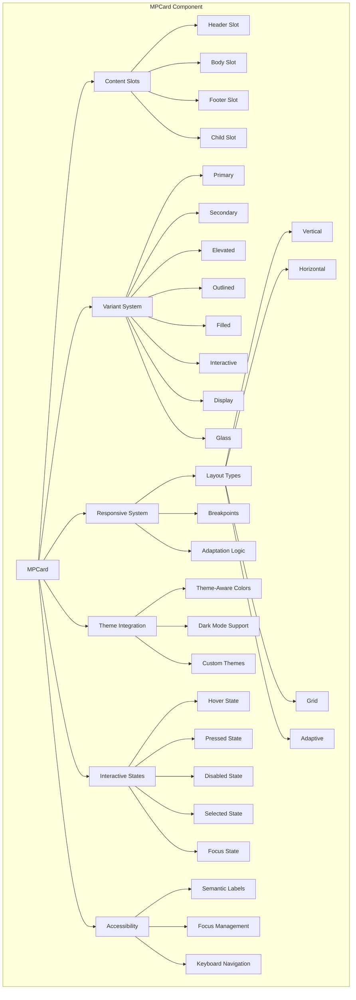
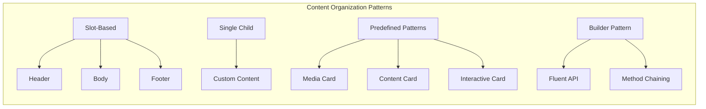
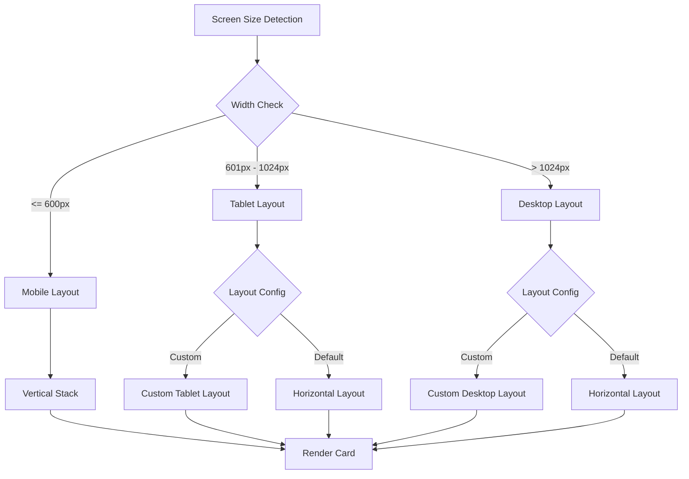
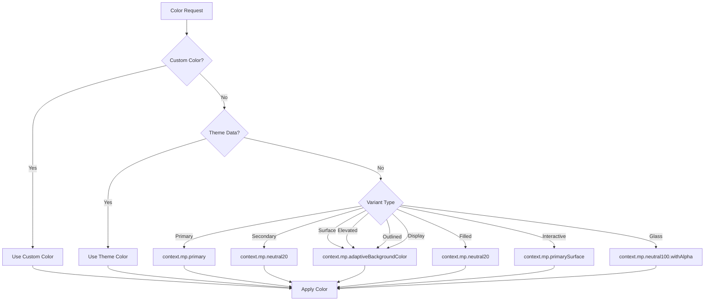
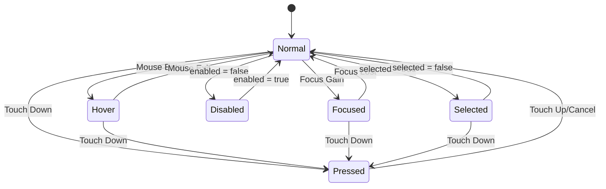
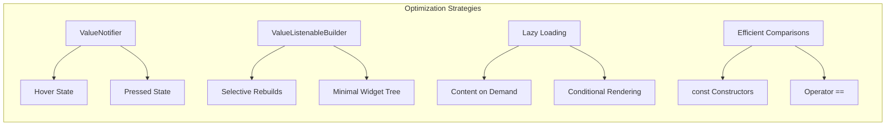
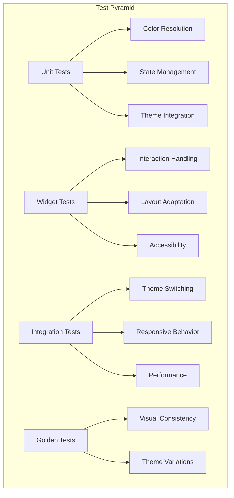
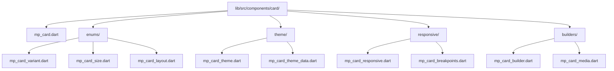
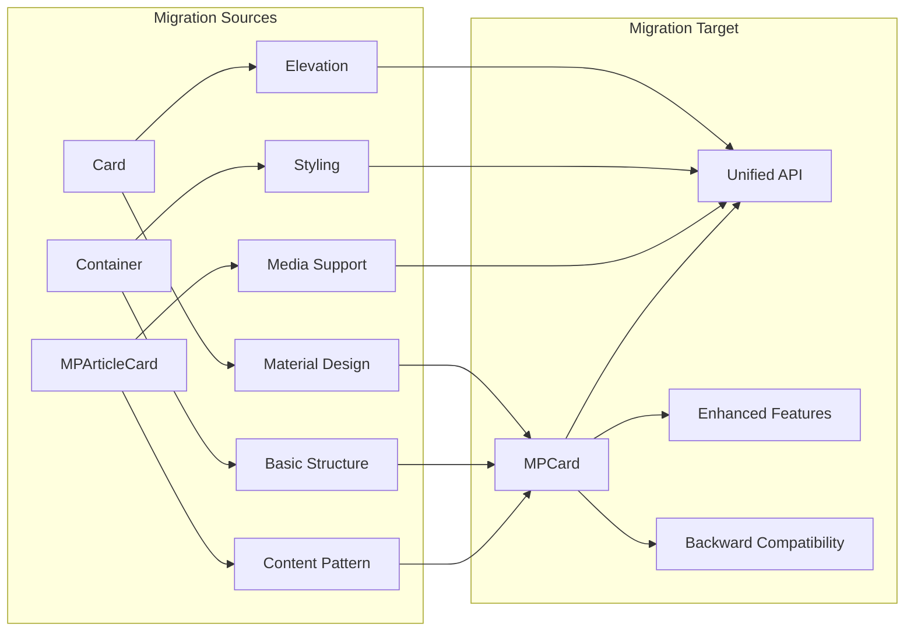
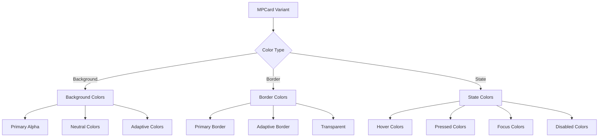

# MPCard Architecture Diagrams

## Component Structure Overview



## Content Slot Architecture



## Responsive Layout System



## Theme Integration Flow



## Interactive State Management



## Component API Design

```mermaid
graph TB
    subgraph "API Layers"
        A[Core Constructor] --> B[All Parameters]

        C[Named Constructors] --> C1[MPCard.media]
        C --> C2[MPCard.content]
        C --> C3[MPCard.interactive]

        D[Builder Pattern] --> D1[MPCard.builder]
        D --> D2[Fluent Methods]
        D --> D3[build()]

        E[Inheritance] --> E1[StatefulWidget]
        E --> E2[Theme Integration]
        E --> E3[Accessibility]
    end

    B --> F[Flexible Usage]
    C1 --> F
    C2 --> F
    C3 --> F
    D3 --> F
```

## Performance Optimization



## Testing Architecture



## File Organization



## Migration Path



## Theme Color Mapping



## Responsive Breakpoint System

```mermaid
graph LR
    subgraph "Screen Sizes"
        A[Mobile] --> A1[≤ 600px]
        B[Tablet] --> B1[601px - 1024px]
        C[Desktop] --> C1[> 1024px]
    end

    subgraph "Layout Adaptation"
        A1 --> D[Vertical Layout]
        B1 --> E[Horizontal/Custom]
        C1 --> F[Horizontal/Custom]
    end

    subgraph "Content Adjustments"
        D --> G[Compact Spacing]
        E --> H[Medium Spacing]
        F --> I[Full Spacing]
    end