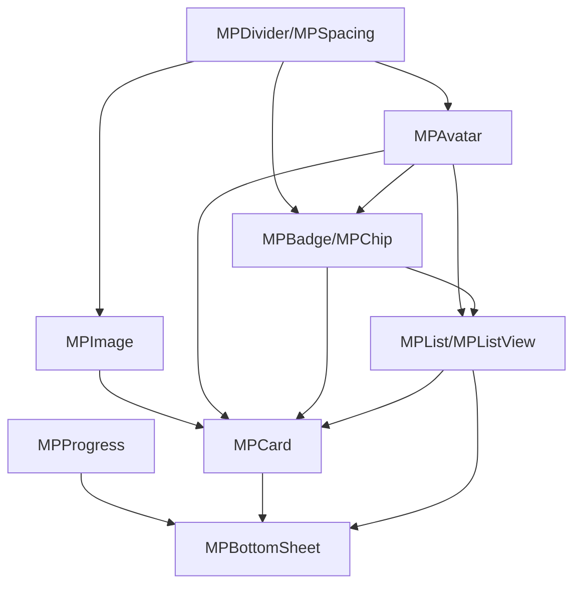

# Micropack UI Kit - Phase 2 Implementation Strategy

## Executive Summary

Phase 2 of the Micropack UI Kit focuses on implementing 8 additional components that will expand the library's capabilities while maintaining consistency with the existing architecture. This document provides a comprehensive implementation strategy covering component architecture, dependencies, theme integration, API design, documentation, and testing.
**Important Note**: Based on current theme detection issues identified in the existing codebase, Phase 2 implementation must include fixes for proper theme detection. The current implementation incorrectly reports theme information due to confusion between `ThemeMode` (user selection) and actual `Brightness` (active theme).

### Theme Detection Issue Analysis

The current theme detection in the home page shows:
- When dark theme is selected: "current theme: dark, brightness: light"
- When light theme is selected: "current theme: light, brightness: light"

This indicates the code is checking `ThemeMode` (user preference) rather than the actual `Brightness` of the active theme.

### Theme Detection Solution

Phase 2 components must implement proper theme detection using this pattern:

```dart
// Correct theme detection pattern
class MPThemeHelper {
  static bool getIsDarkMode(BuildContext context) {
    return Theme.of(context).brightness == Brightness.dark;
  }

  static String getActualThemeName(BuildContext context) {
    final brightness = Theme.of(context).brightness;
    final themeMode = Theme.of(context).brightness == Brightness.dark
        ? 'Dark'
        : 'Light';
    return themeMode;
  }
}

// In components
@override
Widget build(BuildContext context) {
  final isDarkMode = Theme.of(context).brightness == Brightness.dark;
  final actualTheme = isDarkMode ? 'Dark' : 'Light';

  return Container(
    color: isDarkMode ? Colors.black : Colors.white,
    child: Text('Actual theme: $actualTheme'),
  );
}
```


## 1. Component Architecture Design

### 1.1 Overall Architecture Principles

Based on the existing codebase analysis, Phase 2 components will follow these established patterns:

- **Consistent Naming**: All components use `MP` prefix (e.g., `MPCard`, `MPImage`)
- **Enum-based Variants**: Components use enums for variants and sizes (e.g., `MPCardVariant`, `MPCardSize`)
- **Theme Integration**: Full support for light/dark themes via `MPColorTheme` and `MPThemeHelper`
- **Accessibility**: Comprehensive accessibility support with semantic labels
- **Responsive Design**: Adaptive layouts using flutter_screenutil
- **State Management**: StatefulWidget pattern for interactive components

### 1.2 Component Structure Template

Each component will follow this directory structure:
```
lib/src/components/{component_name}/
├── {component_name}.dart          # Export file
├── mp_{component_name}.dart       # Main component implementation
└── enums/                         # Component-specific enums (if needed)
    └── mp_{component_name}_enums.dart
```

### 1.3 Individual Component Architecture

#### 1.3.1 MPCard
```dart
// Enums
enum MPCardVariant {
  standard,
  elevated,
  outlined,
  filled,
}

enum MPCardSize {
  small,
  medium,
  large,
}

// Core Properties
class MPCard extends StatefulWidget {
  final Widget? child;
  final Widget? header;
  final Widget? footer;
  final MPCardVariant variant;
  final MPCardSize size;
  final EdgeInsets? padding;
  final EdgeInsets? margin;
  final double? borderRadius;
  final Color? backgroundColor;
  final double? elevation;
  final bool enabled;
  final VoidCallback? onTap;
  // ... standard properties
}
```

#### 1.3.2 MPImage
```dart
// Enums
enum MPImageShape {
  rectangle,
  rounded,
  circle,
}

enum MPImageSource {
  network,
  asset,
  file,
  memory,
}

// Core Properties
class MPImage extends StatefulWidget {
  final String? imageUrl;
  final String? assetPath;
  final File? file;
  final Uint8List? bytes;
  final MPImageSource source;
  final MPImageShape shape;
  final double? width;
  final double? height;
  final BoxFit fit;
  final Widget? placeholder;
  final Widget? errorWidget;
  final Widget? loadingWidget;
  final bool enableZoom;
  final bool enableGallery;
  // ... standard properties
}
```

#### 1.3.3 MPList/MPListView
```dart
// Enums
enum MPListType {
  basic,
  sectioned,
  grouped,
}

enum MPListItemVariant {
  standard,
  leading,
  trailing,
  twoLine,
  threeLine,
}

// Core Properties
class MPListView extends StatefulWidget {
  final List<MPListItem> items;
  final MPListType type;
  final bool enableInfiniteScroll;
  final bool enablePullToRefresh;
  final VoidCallback? onLoadMore;
  final VoidCallback? onRefresh;
  final Widget? separator;
  final EdgeInsets? padding;
  // ... standard properties
}

class MPListItem {
  final Widget? leading;
  final Widget? title;
  final Widget? subtitle;
  final Widget? trailing;
  final MPListItemVariant variant;
  final VoidCallback? onTap;
  final VoidCallback? onLongPress;
  final bool enabled;
  // ... item properties
}
```

#### 1.3.4 MPChip/MPBadge
```dart
// Enums
enum MPChipVariant {
  filter,
  choice,
  input,
  action,
  suggestion,
}

enum MPBadgeVariant {
  standard,
  dot,
  counter,
}

// Core Properties
class MPChip extends StatefulWidget {
  final Widget? label;
  final Widget? avatar;
  final Widget? icon;
  final MPChipVariant variant;
  final bool selected;
  final bool selectable;
  final VoidCallback? onSelected;
  final VoidCallback? onDeleted;
  final Color? backgroundColor;
  final Color? selectedColor;
  // ... standard properties
}

class MPBadge extends StatelessWidget {
  final Widget? child;
  final String? label;
  final int? count;
  final MPBadgeVariant variant;
  final Color? color;
  final Color? textColor;
  final double? size;
  // ... standard properties
}
```

#### 1.3.5 MPAvatar
```dart
// Enums
enum MPAvatarShape {
  circle,
  rounded,
  square,
}

enum MPAvatarSize {
  xs,
  sm,
  md,
  lg,
  xl,
}

// Core Properties
class MPAvatar extends StatelessWidget {
  final String? imageUrl;
  final String? name;
  final Widget? child;
  final MPAvatarShape shape;
  final MPAvatarSize size;
  final Color? backgroundColor;
  final Color? textColor;
  final Widget? statusIndicator;
  final bool enableGroup;
  final List<MPAvatar>? groupAvatars;
  // ... standard properties
}
```

#### 1.3.6 MPDivider/MPSpacing
```dart
// Enums
enum MPDividerVariant {
  solid,
  dashed,
  dotted,
  gradient,
}

enum MPSpacingSize {
  xs,
  sm,
  md,
  lg,
  xl,
  xxl,
}

// Core Properties
class MPDivider extends StatelessWidget {
  final MPDividerVariant variant;
  final double? thickness;
  final Color? color;
  final double? indent;
  final double? endIndent;
  final bool vertical;
  // ... standard properties
}

class MPSpacing extends StatelessWidget {
  final MPSpacingSize size;
  final bool vertical;
  final double? customSize;
  // ... standard properties
}
```

#### 1.3.7 MPProgress
```dart
// Enums
enum MPProgressType {
  linear,
  circular,
  step,
}

enum MPProgressVariant {
  determinate,
  indeterminate,
  buffer,
}

// Core Properties
class MPProgress extends StatefulWidget {
  final MPProgressType type;
  final MPProgressVariant variant;
  final double value;
  final double? bufferValue;
  final Color? color;
  final Color? backgroundColor;
  final double? strokeWidth;
  final double? size;
  final String? label;
  final bool showPercentage;
  final List<MPStep>? steps;
  // ... standard properties
}
```

#### 1.3.8 MPBottomSheet
```dart
// Enums
enum MPBottomSheetVariant {
  standard,
  modal,
  persistent,
  draggable,
}

enum MPBottomSheetSize {
  small,
  medium,
  large,
  full,
}

// Core Properties
class MPBottomSheet extends StatefulWidget {
  final Widget? header;
  final Widget? body;
  final List<Widget>? actions;
  final MPBottomSheetVariant variant;
  final MPBottomSheetSize size;
  final bool barrierDismissible;
  final bool enableDrag;
  final double? maxHeight;
  final double? minHeight;
  final VoidCallback? onClose;
  // ... standard properties
}
```

## 2. Implementation Priority and Dependencies

### 2.1 Implementation Order

Based on component complexity and dependencies, the recommended implementation order is:

1. **MPDivider/MPSpacing** (Week 1)
   - Lowest complexity
   - No dependencies
   - Foundation component for others

2. **MPAvatar** (Week 1-2)
   - Low complexity
   - Used by other components (MPList, MPChip)
   - Simple state management

3. **MPBadge/MPChip** (Week 2)
   - Medium complexity
   - Depends on MPAvatar
   - Used by MPList and MPCard

4. **MPImage** (Week 2-3)
   - Medium complexity
   - Used by MPCard, MPAvatar, MPList
   - Requires async handling

5. **MPCard** (Week 3)
   - Medium-high complexity
   - Depends on MPImage, MPBadge, MPAvatar
   - Complex layout and interactions

6. **MPList/MPListView** (Week 3-4)
   - High complexity
   - Depends on MPAvatar, MPBadge, MPChip
   - Complex state management and scrolling

7. **MPProgress** (Week 4)
   - Medium complexity
   - Independent component
   - Animation-heavy

8. **MPBottomSheet** (Week 4-5)
   - Highest complexity
   - Complex animations and gestures
   - Modal management

### 2.2 Dependency Graph



## 3. Theme Integration Strategy

### 3.1 Color Theme Extensions

Extend the existing `MPColorTheme` to support new components:

```dart
class MPColorTheme extends ThemeExtension<MPColorTheme> {
  // Existing colors...

  // New component-specific colors
  final Color? cardBackground;
  final Color? cardBorder;
  final Color? chipBackground;
  final Color? chipSelected;
  final Color? avatarBackground;
  final Color? progressTrack;
  final Color? bottomSheetOverlay;
  final Color? dividerColor;

  // ... existing implementation
}
```

### 3.2 Adaptive Color Usage

All components will use the established pattern via `context.mp` extension with corrected theme detection:

```dart
// Example usage in components
Color getBackgroundColor(BuildContext context) {
  // Correct theme detection
  final isDarkMode = Theme.of(context).brightness == Brightness.dark;

  switch (variant) {
    case MPCardVariant.standard:
      return context.mp.adaptiveBackgroundColor;
    case MPCardVariant.elevated:
      return isDarkMode ? context.mp.neutral20 : context.mp.neutral100;
    case MPCardVariant.outlined:
      return Colors.transparent;
  }
}

// Theme-aware widget implementation
@override
Widget build(BuildContext context) {
  final isDarkMode = Theme.of(context).brightness == Brightness.dark;

  return Container(
    color: getBackgroundColor(context),
    child: Text(
      'Theme: ${isDarkMode ? 'Dark' : 'Light'}',
      style: TextStyle(color: context.mp.textColor),
    ),
  );
}
```

### 3.3 Theme Detection Standardization

All Phase 2 components must implement this standardized theme detection pattern:

```dart
// Base class for theme-aware components
abstract class MPThemeAwareWidget extends StatelessWidget {
  const MPThemeAwareWidget({super.key});

  @override
  Widget build(BuildContext context) {
    return buildWithTheme(context, _getThemeInfo(context));
  }

  Widget buildWithTheme(BuildContext context, MPThemeInfo themeInfo);

  MPThemeInfo _getThemeInfo(BuildContext context) {
    final brightness = Theme.of(context).brightness;
    return MPThemeInfo(
      isDarkMode: brightness == Brightness.dark,
      brightness: brightness,
      themeName: brightness == Brightness.dark ? 'Dark' : 'Light',
    );
  }
}

class MPThemeInfo {
  final bool isDarkMode;
  final Brightness brightness;
  final String themeName;

  const MPThemeInfo({
    required this.isDarkMode,
    required this.brightness,
    required this.themeName,
  });
}
```

### 3.4 Theme-aware Properties

Each component will implement:
- Adaptive colors for light/dark themes
- Proper contrast ratios
- Theme switching animations
- Customizable theme overrides
- Correct theme detection using `Theme.of(context).brightness`

## 4. API Design Guidelines

### 4.1 Consistent Naming Conventions

- **Components**: `MP{ComponentName}` (e.g., `MPCard`, `MPImage`)
- **Enums**: `{ComponentName}{Property}` (e.g., `MPCardVariant`, `MPCardSize`)
- **Properties**: camelCase with descriptive names
- **Callbacks**: `on{Action}` (e.g., `onTap`, `onSelected`, `onChanged`)

### 4.2 Standard Properties Pattern

All components will include these standard properties:

```dart
// Common across all interactive components
final bool enabled;
final VoidCallback? onTap;
final VoidCallback? onLongPress;
final String? semanticLabel;
final FocusNode? focusNode;
final bool autofocus;

// Common across all visual components
final EdgeInsets? padding;
final EdgeInsets? margin;
final Color? backgroundColor;
final double? borderRadius;
final Widget? child;
```

### 4.3 Constructor Patterns

Follow the established pattern with named constructors:

```dart
class MPCard extends StatefulWidget {
  // Default constructor
  const MPCard({
    required this.child,
    // ... properties
  });

  // Named constructors for common variants
  const MPCard.elevated({
    required this.child,
    // ... properties
  }) : variant = MPCardVariant.elevated;

  const MPCard.outlined({
    required this.child,
    // ... properties
  }) : variant = MPCardVariant.outlined;
}
```

### 4.4 Parameter Validation

Implement comprehensive parameter validation:

```dart
@override
State<MPCard> createState() => _MPCardState();

// In the component implementation
void _validateParameters() {
  assert(child != null, 'Child widget is required');
  assert(width != null || height != null, 'At least one dimension must be specified');
}
```

## 5. Documentation and Testing Strategy

### 5.1 Documentation Structure

For each component, create:

1. **API Documentation**
   - Class-level documentation with examples
   - Property descriptions with types and defaults
   - Enum value explanations
   - Usage examples

2. **Implementation Guide**
   - Step-by-step implementation instructions
   - Code examples for common use cases
   - Best practices and recommendations

3. **Theme Integration Guide**
   - Theme customization examples
   - Color scheme explanations
   - Dark mode considerations

### 5.2 Testing Strategy

#### 5.2.1 Unit Tests
- Test all public methods and properties
- Validate parameter constraints
- Test state management logic
- Mock dependencies where needed

#### 5.2.2 Widget Tests
- Test component rendering
- Test user interactions
- Test theme adaptation
- Test accessibility features

#### 5.2.3 Integration Tests
- Test component interactions
- Test theme switching
- Test responsive behavior
- Test performance with large datasets

#### 5.2.4 Golden Tests
- Visual regression testing
- Theme comparison tests
- Variant comparison tests

### 5.3 Test Coverage Requirements

- **Minimum 90% code coverage**
- **100% coverage for public APIs**
- **All variants and states tested**
- **All theme combinations tested**

## 6. Example App Integration

### 6.1 Navigation Structure

Update the home page to include Phase 2 components:

```dart
// In example/lib/pages/home_page.dart
const _SectionTitle(title: 'Phase 2 Components'),
const _Button(name: 'Card', page: CardPage()),
const _Button(name: 'Image', page: ImagePage()),
const _Button(name: 'List', page: ListPage()),
const _Button(name: 'Chip & Badge', page: ChipBadgePage()),
const _Button(name: 'Avatar', page: AvatarPage()),
const _Button(name: 'Divider & Spacing', page: DividerSpacingPage()),
const _Button(name: 'Progress', page: ProgressPage()),
const _Button(name: 'Bottom Sheet', page: BottomSheetPage()),
```

### 6.2 Component Showcase Pages

Each component will have a dedicated showcase page with:


### 7.4 Theme Detection Fixes

As part of Phase 2 implementation, the existing theme detection issue in the home page must be fixed:

```dart
// Current problematic implementation in home_page.dart
Text('Current Theme: ${themeProvider.getThemeName()}'),
Text('Brightness: ${context.mp.isDarkMode ? 'Dark' : 'Light'}'),

// Corrected implementation
Text('Current Theme: ${themeProvider.getThemeName()}'),
Text('Brightness: ${Theme.of(context).brightness == Brightness.dark ? 'Dark' : 'Light'}'),
Text('Active Theme: ${Theme.of(context).brightness == Brightness.dark ? 'Dark' : 'Light'}'),
```

This fix ensures that:
1. The theme provider shows user selection (Light/Dark/System)
2. The actual active theme is correctly detected
3. Both values are displayed accurately for debugging

1. **Basic Examples**
   - Simple usage examples
   - All variants demonstrated
   - Different sizes and states

2. **Advanced Examples**
   - Complex usage scenarios
   - Custom styling examples
   - Integration with other components

3. **Theme Examples**
   - Light/dark mode comparison
   - Custom theme examples
   - Theme switching demonstrations

4. **Interactive Examples**
   - User interaction demos
   - State changes visualization
   - Real-time customization

### 6.3 Example App Structure

```
example/lib/pages/
├── phase2/
│   ├── card_page.dart
│   ├── image_page.dart
│   ├── list_page.dart
│   ├── chip_badge_page.dart
│   ├── avatar_page.dart
│   ├── divider_spacing_page.dart
│   ├── progress_page.dart
│   └── bottom_sheet_page.dart
```

## 7. Implementation Timeline

### Week 1: Foundation Components
- **MPDivider/MPSpacing** (2 days)
- **MPAvatar** (3 days)
- Basic documentation and tests

### Week 2: Interactive Components
- **MPBadge/MPChip** (3 days)
- **MPImage** (2 days)
- Documentation and tests

### Week 3: Complex Components
- **MPCard** (3 days)
- **MPList/MPListView** (2 days)
- Documentation and tests

### Week 4: Advanced Components
- **MPProgress** (2 days)
- **MPBottomSheet** (3 days)
- Documentation and tests

### Week 5: Integration and Polish
- Example app integration
- Cross-component testing
- Documentation review
- Performance optimization

## 8. Quality Assurance

### 8.1 Code Quality Standards

- **Linting**: Follow existing linting rules
- **Code Review**: All changes require review
- **Documentation**: All public APIs documented
- **Testing**: Minimum 90% coverage requirement

### 8.2 Performance Requirements

- **Rendering**: 60fps target for all animations
- **Memory**: Efficient memory usage for large datasets
- **Startup**: Minimal impact on app startup time
- **Bundle Size**: Optimize for minimal bundle impact

### 8.3 Accessibility Standards

- **WCAG 2.1 AA compliance**
- **Screen reader support**
- **Keyboard navigation**
- **High contrast support**
- **Semantic labels for all interactive elements**

## 9. Risk Mitigation

### 9.1 Technical Risks

1. **Performance Issues**
   - Mitigation: Performance testing throughout development
   - Monitoring: Profile memory and rendering performance

2. **Theme Consistency**
   - Mitigation: Comprehensive theme testing
   - Monitoring: Automated visual regression tests

3. **Component Dependencies**
   - Mitigation: Clear dependency management
   - Monitoring: Integration tests for all dependencies

### 9.2 Timeline Risks

1. **Complex Component Delays**
   - Mitigation: Start with simpler components first
   - Monitoring: Weekly progress reviews

2. **Testing Overruns**
   - Mitigation: Parallel development and testing
   - Monitoring: Daily test coverage reports

## 10. Success Metrics

### 10.1 Development Metrics

- **Components completed**: 8/8 on time
- **Code coverage**: ≥90% for all components
- **Documentation**: 100% API coverage
- **Performance**: ≤16ms render time for all components

### 10.2 Quality Metrics

- **Bug count**: Zero critical bugs at release
- **Accessibility**: 100% WCAG 2.1 AA compliance
- **Theme consistency**: 100% theme adaptation
- **User satisfaction**: Positive feedback from testing

## 11. Conclusion

This Phase 2 implementation strategy provides a comprehensive roadmap for expanding the Micropack UI Kit with 8 new components while maintaining the high quality and consistency established in Phase 1. The strategy emphasizes:

- **Consistent architecture** with existing patterns
- **Thorough testing** with high coverage requirements
- **Comprehensive documentation** for all components
- **Accessibility** as a core requirement
- **Performance** optimization throughout development

Following this strategy will result in a robust, well-documented, and highly usable set of components that integrate seamlessly with the existing Micropack UI Kit ecosystem.